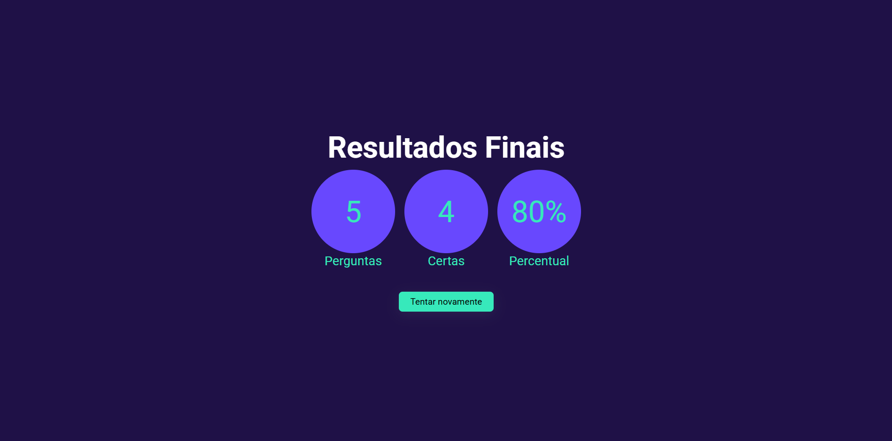

<h1 align="center">Quiz</h1>

<p align="center">
    <a href="#sobre">Sobre</a> •
    <a href="#instalacao">Instalação</a>
</p>

<h2 id="sobre">✨ Sobre</h2>

Uma aplicação feita em Next.js de perguntas e respostas.

<p align="center">
    
&nbsp;
    
</p>


<h2 id="instalacao">🚀 Como executar o projeto</h2>
Siga os passos abaixo para executar o projeto em seu ambiente local:
   
1. **Clone o repositório**
   ```bash
   https://github.com/Victordplima/Quiz.git
   ```
   
2. **Navegue até os arquivos**
   ```bash
   cd Quiz
   ```

3. **Instalação de Dependências**
   ```bash
   npm install
   ```

4. **Inicialização da Aplicação**
   ```bash
   npm run dev
   ```
